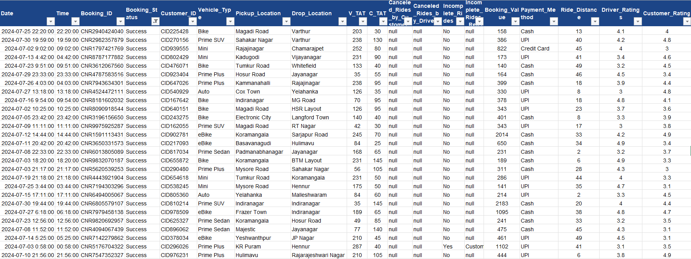
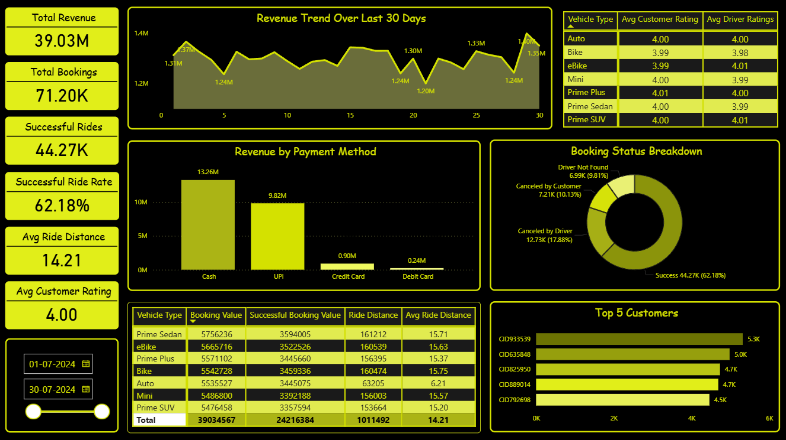

# OLA Ride Performance Analysis | SQL + Power BI

## Project Overview

This project analyzes ride-hailing data to evaluate booking performance, revenue generation, cancellation behavior, and customer usage patterns.

Using SQL, key business queries were performed to extract insights such as successful bookings, ride distance trends, cancellation counts, and top customers. These insights were then visualized in Power BI through an interactive dashboard to monitor ride efficiency, revenue distribution, and operational performance.

---

## Business Context

Ride-hailing operations depend heavily on ride completion rates, cancellation behavior, and customer demand patterns, all of which directly impact revenue and service efficiency.

This analysis focuses on:

- Monitoring successful vs cancelled rides to understand operational efficiency

- Identifying cancellation patterns from both customers and drivers

- Analyzing revenue contribution across vehicle types and payment methods

- Evaluating customer behavior and ride frequencye

---

## Business Objectives

- Analyze total bookings and successful ride rate

- Evaluate revenue performance (booking value trends)

- Identify cancellation patterns by customers and drivers

- Measure average ride distance and customer ratings

- Identify top customers based on ride frequency

- Understand payment method contribution to revenue

---

Dataset Preview

---

## Dataset Information

| Column Name                | Data Type | Description                                              | Business Relevance |
|----------------------------|----------|------------------------------------------------------------|--------------------|
| Date                       | Date     | Ride booking date                                          | Used for trend analysis and time-based insights |
| Time                       | Time     | Ride booking time                                          | Helps identify peak demand hours |
| Booking_ID                 | String   | Unique ride identifier                                     | Used to count total rides |
| Booking_Status             | String   | Status (Success, Cancelled, Incomplete)                    | Key metric for ride success and cancellations |
| Customer_ID                | String   | Unique customer identifier                                 | Used for customer-level analysis |
| Vehicle_Type               | String   | Type of vehicle booked                                     | Helps analyze performance across vehicle categories |
| Pickup_Location            | String   | Ride pickup location                                       | Useful for location-based demand analysis |
| Drop_Location              | String   | Ride drop location                                         | Helps identify popular routes |
| V_TAT                      | Integer  | Vehicle Turnaround Time (time to assign vehicle)           | Measures operational efficiency |
| C_TAT                      | Integer  | Customer Waiting Time before ride start                    | Impacts customer satisfaction |
| Canceled_Rides_by_Customer | String   | Reason for cancellation by customer                        | Helps identify customer-side issues |
| Canceled_Rides_by_Driver   | String   | Reason for cancellation by driver                          | Helps identify driver-side issues |
| Incomplete_Rides           | String   | Indicates whether a ride was incomplete                    | Tracks failed ride executions |
| Incomplete_Rides_Reason    | String   | Reason for incomplete rides                                | Helps diagnose operational failures |
| Booking_Value              | Decimal  | Total fare amount                                          | Core revenue metric |
| Payment_Method             | String   | Mode of payment (Cash, UPI, etc.)                          | Helps analyze payment behavior |
| Ride_Distance              | Decimal  | Distance traveled per ride                                 | Used for pricing and demand analysis |
| Driver_Ratings             | Decimal  | Rating given to driver                                     | Measures driver performance |
| Customer_Rating            | Decimal  | Rating given by customer                                   | Measures customer satisfaction |

---

## DAX Calculations

**Total Rides** = 
COUNT(ride_data[Booking_ID])

**Successful Rides** = 
CALCULATE(
    COUNT(ride_data[Booking_ID]),
    ride_data[Booking_Status] = "Success"
)

**Successful Ride Rate** = 
DIVIDE(
    [Successful Rides],
    [Total Rides]
)

**Successful Booking Value** = 
CALCULATE(
    SUM(ride_data[booking_value]),
    ride_data[Booking_Status] = "Success"
)

---

## SQL Analysis

SQL was used to perform detailed data analysis and answer specific business questions, including ride success rates, cancellation behavior, customer patterns, and revenue calculations.

The SQL analysis forms the foundation for insights visualized in the Power BI dashboard.

### 1. Ride Completion Efficiency

**Business Problem:**
How efficiently are ride bookings being converted into successful rides?

**Key Insight:**
A significant portion of bookings do not result in completed rides, as seen from cancelled and incomplete ride records in SQL analysis, indicating gaps in operational efficiency.

**Business Recommendation:**
Improve driver allocation speed and reduce ride acceptance delays. Introduce stricter cancellation monitoring to increase ride completion rates.

---

### 2. Customer vs Driver Cancellation Behavior

**Business Problem:**
What are the key drivers behind ride cancellations from customers and drivers?

**Key Insight:**
SQL analysis shows that cancellations occur from both customer and driver sides, with driver cancellations often linked to personal or vehicle-related issues.

**Business Recommendation:**
Implement driver incentives and accountability measures to reduce cancellations. Improve customer experience to minimize last-minute ride cancellations.

---

### 3. Revenue Realization from Successful Rides

**Business Problem:**
How much revenue is actually realized from successfully completed rides?

**Key Insight:**
Revenue is generated only from successful bookings, meaning cancelled and incomplete rides contribute to revenue loss and missed opportunities.

**Business Recommendation:**
Focus on improving ride success rates to maximize revenue realization and track revenue leakage caused by failed bookings.

---

### 4. Customer Retention & High-Value Users

**Business Problem:**
Who are the most frequent customers and how concentrated is ride demand?

**Key Insight:**
A small group of customers contributes a high number of bookings, indicating dependency on high-frequency users.

**Business Recommendation:**
Introduce loyalty programs and targeted offers to retain high-value customers while expanding the overall customer base.

---

### 5. Vehicle-Type Performance

**Business Problem:**
How does ride performance vary across different vehicle types?

**Key Insight:**
Ride distance and usage patterns differ across vehicle types, indicating variation in demand and customer preferences.

**Business Recommendation:**
Optimize vehicle allocation and pricing strategies based on demand patterns for each vehicle category.

---

### 6. Ride Distance & Usage Patterns

**Business Problem:**
What does ride distance indicate about customer travel behavior?

**Key Insight:**
Ride distance analysis shows a mix of short and mid-range trips, reflecting typical urban travel demand.

**Business Recommendation:**
Implement distance-based pricing and align vehicle availability to match trip distance patterns.

---

### 7. Customer Satisfaction (Ratings Analysis)

**Business Problem:**
What is the overall customer satisfaction level across rides?

**Key Insight:**
Customer ratings indicate consistent service quality but highlight scope for improvement in overall experience.

**Business Recommendation:**
Monitor low-rated rides and improve service quality through driver training and feedback systems.

---

### 8. Payment Method Usage

**Business Problem:**
Which payment methods are most commonly used by customers?

**Key Insight:**
SQL analysis highlights strong usage of specific payment methods such as UPI, indicating customer preference trends.

**Business Recommendation:**
Promote digital payment options further and provide incentives to diversify payment method usage.

---

The insights derived from SQL analysis were used to design key metrics and visualizations in the Power BI dashboard:

- Ride success rate → KPI Card
- Revenue from successful bookings → KPI & Trend Chart
- Top customers → Table visualization
- Vehicle performance → Bar Chart
- Payment method usage → Pie Chart

---

## Dashboard Preview

---

## Key Performance Indicators

- Total Revenue: 39.03M

- Total Bookings: 71.20K

- Successful Rides: 44.27K

- Successful Ride Rate: 62.18%

- Average Ride Distance: 14.21 km

- Average Customer Rating: 4.00

---

## Dashboard Features

- Revenue trend analysis over the last 30 days

- Booking status distribution (Success vs Cancellations)

- Revenue breakdown by payment method

- Vehicle-wise performance metrics

- Customer and driver rating comparison

- Identification of top 5 high-value customers

- Interactive filters for dynamic analysis

---

## Business Questions

- What percentage of total bookings are successfully completed, and how efficient is the ride fulfillment process?

- How much revenue is generated from completed rides, and how does it trend over time?

- Which payment methods contribute the most to total revenue, and is there over-dependence on specific modes?

- Which vehicle types generate the highest revenue, and how does their performance compare in terms of ride volume?

- Who are the top customers contributing to ride frequency, and how concentrated is the demand?

- What is the average ride distance, and what does it indicate about customer travel patterns?

- What is the overall customer satisfaction level based on ratings, and does it indicate stable service quality?

---

## Key Insights

- The ride success rate is **~62%**, meaning nearly **38% of bookings do not convert into completed rides**, indicating a significant gap in operational efficiency.

- Total revenue stands at **~39M**, but this reflects only completed rides, suggesting that a substantial portion of potential revenue is lost due to unsuccessful bookings.

- Revenue is heavily concentrated in **Cash and UPI payments**, indicating a strong dependency on these methods and low diversification in payment channels.

- Certain vehicle types generate **higher revenue with comparable ride volumes**, highlighting differences in pricing and customer preference across categories.

- A small group of customers appears repeatedly in the top bookings, suggesting **customer concentration**, where a limited segment drives a significant share of demand.

- The average ride distance of **~14 km** indicates a balanced mix of short and medium-distance trips, reflecting typical urban mobility patterns.

- Customer ratings average around **4.0**, indicating stable but not exceptional service quality, leaving room for improvement in customer experience.

---

## Business Recommendations

- **Improve ride completion rate:**  
  Focus on reducing the ~38% failure rate by optimizing driver allocation and minimizing delays in ride acceptance.

- **Reduce revenue leakage:**  
  Convert more bookings into successful rides by addressing cancellation causes identified in SQL analysis.

- **Diversify payment methods:**  
  Promote card and wallet usage through targeted incentives to reduce over-dependence on cash and UPI.

- **Optimize vehicle supply strategy:**  
  Increase availability of high-performing vehicle types that generate higher revenue to maximize earnings.

- **Strengthen customer retention:**  
  Introduce loyalty programs for high-frequency users who contribute significantly to booking volume.

- **Enhance long-distance ride incentives:**  
  Provide driver incentives for longer trips to ensure availability and reduce cancellation probability for high-value rides.

- **Enhance customer experience:**  
  Improve service quality to push ratings beyond 4.0 by reducing wait times and ensuring ride reliability.

---  
   
## Tools Used

- Excel (Data Source & Preparation)

- My SQL (Data Analysis & Querying)

- Power BI (Dashboard & Visualization)

---

## Skills Demonstrated

- Data Cleaning and Preparation

- SQL Query Writing and Analysis

- KPI Development

- DAX Calculations

- Data Visualization and Dashboard Design

- Business Insight Generation

- Analytical Thinking and Problem Solving

---

## Data Workflow

1. Excel Dataset
2. SQL Analysis
3. Data Exploration
4. Power BI Dashboard
5. Insights & Recommendations

---

## Project Structure

ola-ride-performance-analysis/

├── data/
│   └── ola_ride_operations_dataset.xlsx       
├── sql/
│   └── business_analysis.sql                  

├── powerbi/
│   └── ola_ride_performance_dashboard.pbix     

├── dashboard_images/
│   ├── ola_dashboard_overview.png             
│   └── ola_dataset_preview.png                 
└── README.md                                   

---

## Repository Structure

- **data/** - ola_ride_operations_dataset.xlsx
  - Contains raw and processed datasets used for analysis

- **sql/** - business_analysis.sql
  - Includes SQL scripts for database creation and business analysis

- **powerbi/** - ola_ride_performance_dashboard.pbix
  - Contains the Power BI dashboard file (.pbix)

- **dashboard_images/** - ola_dashboard_overview.png
  - Stores screenshots used in the README for visualization preview

- **README.md**
  - Complete project documentation and insights
  
---

## How to Use

1. Download the dataset from the dataset folder

2. Run SQL queries from sql/business_analysis.sql

3. Open the Power BI file to explore the dashboard

4. Use filters to analyze trends across vehicle types and booking status

5. Review insights and recommendations for business understanding

---

## Conclusion

This project demonstrates how raw operational data can be transformed into meaningful business insights using SQL and Power BI. The analysis highlights key inefficiencies in ride completion and provides actionable recommendations to improve revenue, customer experience, and operational performance.

---

## Author

**Sarvesh Vernekar**

Aspiring Data Analyst focused on transforming business data into actionable insights through analytics, visualization, and data-driven decision making.
